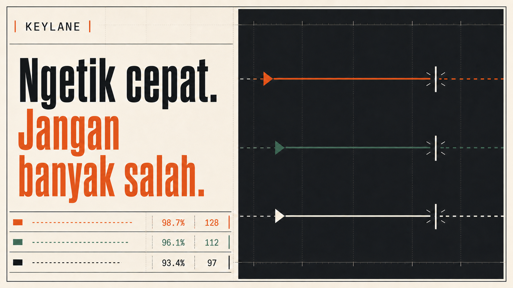

# Keylane

**Ngetik cepat. Jangan banyak salah.**

Keylane adalah game mengetik multiplayer berbahasa Indonesia. Pengguna dapat berlatih sebagai tamu, membuat akun untuk menyimpan statistik, mengikuti tantangan harian, membuat private room, balapan realtime, mencari lawan, melihat leaderboard, dan mengelola konten melalui panel admin.



## Fitur

- Landing page responsif dengan leaderboard database dan empty state.
- Supabase Auth melalui cookie SSR: daftar, masuk, keluar, lupa password, dan reset password.
- Profile trigger, role `player`/`admin`, serta proteksi field statistik di database.
- Typing engine strict dengan countdown timestamp, komposisi input, Backspace, paste/drop blocking, WPM, akurasi, progress, dan dukungan mobile keyboard.
- Practice quote, 30 detik, 60 detik, dan tantangan harian; pemilihan acak menghindari teks sesi sebelumnya jika ada alternatif, dan tamu tetap dapat bermain secara lokal.
- Dashboard, grafik performa, profil publik, histori, settings, XP, level, streak, dan achievement.
- Private/public room, kode enam karakter, lobby, Presence, ready state, host transfer, kick, cancel, countdown sinkron, race, progress Broadcast, dan podium hasil.
- Quick matchmaking transaksional dengan rentang rating yang melebar.
- Leaderboard WPM, rating, kemenangan, dan tantangan harian.
- Admin dashboard, kategori, teks, pengguna, room, hasil mencurigakan, dan audit log.
- RLS, idempotent finish, database-backed rate limit, server-authoritative scoring, dan cron cleanup.
- Unit, contract integration, dan Playwright E2E tests.

## Teknologi

- Next.js 16 App Router, React 19, dan TypeScript strict.
- Tailwind CSS 4, Geist/Geist Mono melalui `next/font`, dan Lucide React.
- Supabase PostgreSQL, Auth, Realtime, `@supabase/supabase-js`, dan `@supabase/ssr`.
- Zod, React Hook Form, Vitest, React Testing Library, dan Playwright.
- Vercel untuk frontend, Route Handlers, dan cron.

## Persyaratan

- Node.js 20.9 atau lebih baru (Node.js 22 LTS disarankan).
- npm 10 atau lebih baru.
- Proyek Supabase dengan akses SQL Editor.
- Akun Vercel untuk deployment produksi.

## Instalasi lokal

```bash
npm install
cp .env.example .env.local
npm run dev
```

Buka `http://localhost:3000`. Tanpa environment Supabase, landing page dan latihan tamu tetap bekerja memakai teks fallback. Halaman akun, database, leaderboard resmi, multiplayer, dan admin memerlukan Supabase.

Pada PowerShell, gunakan:

```powershell
Copy-Item .env.example .env.local
npm.cmd run dev
```

## Environment variables

```env
NEXT_PUBLIC_SUPABASE_URL=
NEXT_PUBLIC_SUPABASE_PUBLISHABLE_KEY=
SUPABASE_SECRET_KEY=
NEXT_PUBLIC_SITE_URL=http://localhost:3000
CRON_SECRET=
```

- `NEXT_PUBLIC_SUPABASE_URL`: Project URL dari Supabase Connect.
- `NEXT_PUBLIC_SUPABASE_PUBLISHABLE_KEY`: publishable key yang aman dipakai browser dan tetap dibatasi RLS.
- `SUPABASE_SECRET_KEY`: secret key server-only untuk admin dan rate limiting. Jangan memakai prefiks `NEXT_PUBLIC_`.
- `NEXT_PUBLIC_SITE_URL`: origin deployment tanpa trailing slash.
- `CRON_SECRET`: nilai acak panjang untuk melindungi route cleanup.

Jangan commit `.env.local`. Secret key hanya diimpor oleh modul dengan `server-only`.

## Menyiapkan Supabase

1. Buat proyek di Supabase.
2. Buka SQL Editor.
3. Jalankan migration dalam urutan nama file:

   - `supabase/migrations/202607220001_initial_keylane.sql`
   - `supabase/migrations/202607220002_race_rls_views.sql`
   - `supabase/migrations/202607220003_practice_timing.sql`
   - `supabase/migrations/202607220004_public_performance.sql`
   - `supabase/migrations/202607220005_room_controls.sql`
   - `supabase/migrations/202607220006_participant_rls.sql`
   - `supabase/migrations/202607220007_leaderboard_views.sql`
   - `supabase/migrations/202607220008_security_hardening.sql`
   - `supabase/migrations/202607220009_completion_hardening.sql`
   - `supabase/migrations/202607230010_avoid_consecutive_texts.sql`
   - `supabase/migrations/202607230011_active_room_recovery.sql`
   - `supabase/migrations/202607230012_practice_finish_reliability.sql`
   - `supabase/migrations/202607230013_fix_practice_status_enum.sql`

4. Jalankan `supabase/seed.sql` sekali.
5. Salin Project URL, publishable key, dan secret key ke `.env.local`.
6. Pada Authentication → URL Configuration, atur:

   - Site URL development: `http://localhost:3000`
   - Redirect development: `http://localhost:3000/auth/callback`
   - Redirect production: `https://domain-anda.vercel.app/auth/callback`

7. Pada Realtime Settings, pastikan private channel authorization tersedia. Channel Keylane memakai topik `race:<room_uuid>` dan policy pada `realtime.messages`.

Jika Supabase CLI tersedia, migration dan seed juga dapat diterapkan dengan alur lokal standar Supabase. File SQL tetap menjadi sumber kebenaran dan tidak memerlukan Prisma.

## Membuat admin

Daftar pengguna biasa melalui UI, lalu jalankan perintah berikut di Supabase SQL Editor menggunakan UUID pengguna atau email. Jangan menaruh password admin di seed.

```sql
update public.profiles
set role = 'admin'
where id = (
  select id from auth.users where email = 'admin@example.com'
);
```

Keluar dan masuk kembali. Route `/admin` memeriksa role di server; setiap endpoint admin memeriksanya lagi sebelum memakai secret client. Perubahan role dan moderasi dicatat di `admin_audit_logs`.

## Script

```bash
npm run dev          # development server
npm run typecheck    # generate route types + TypeScript
npm run lint         # ESLint
npm test             # Vitest unit + integration contract
npm run test:e2e     # Playwright
npm run build        # production build
npm run start        # serve production build
npm run format:check # verify Prettier formatting
```

E2E yang memerlukan akun nyata otomatis dilewati jika kredensial berikut tidak tersedia:

```env
E2E_PLAYER_EMAIL=
E2E_PLAYER_PASSWORD=
E2E_PLAYER_TWO_EMAIL=
E2E_PLAYER_TWO_PASSWORD=
E2E_ADMIN_EMAIL=
E2E_ADMIN_PASSWORD=
E2E_SIGNUP_EMAIL=
E2E_SIGNUP_PASSWORD=
```

Gunakan proyek Supabase khusus test. Dua akun player diperlukan untuk integration test RLS/lifecycle dan skenario realtime; akun admin harus telah dinaikkan rolenya melalui SQL. `E2E_SIGNUP_*` harus menunjuk ke alamat disposable yang aman digunakan berulang pada proyek test.

## Struktur folder

```text
app/                 App Router pages dan Route Handlers
components/          UI, layout, auth, game, race, dashboard, admin
data/                Data access khusus Server Components
lib/supabase/        Browser, server-cookie, admin, dan auth clients
lib/typing/          Typing reducer, countdown, metrics, fallback text
lib/race/            Rating dan room code utilities
lib/security/        Rate limit dan suspicious detection
lib/validation/      Zod schemas
supabase/migrations/ Schema, functions, RLS, views, dan Realtime policy
supabase/seed.sql     30 teks Indonesia + kategori + achievement
tests/unit/           Utility dan component tests
tests/integration/    Database/API contract tests
tests/e2e/            Browser journeys dan dua-context multiplayer
```

## Realtime dan hasil resmi

Supabase Presence hanya menyimpan status koneksi. Progress provisional dikirim lewat Broadcast maksimal sekitar sekali setiap 180 ms untuk animasi lawan, sedangkan snapshot tervalidasi disimpan berkala ke PostgreSQL. Broadcast kontrol hanya menjadi sinyal refresh; start, cancel, kick, status, dan hasil selalu dibaca ulang dari database. Reconnect mengembalikan posisi lokal dari snapshot participant yang durable.

Browser tidak menentukan WPM resmi, akurasi, placement, rating, XP, kemenangan, atau achievement. Client mengirim counter mentah dan nonce. PostgreSQL mengunci room/participant, menggunakan `starts_at`, menghitung ulang hasil, membuat placement unik, mengubah rating, dan mengevaluasi achievement di dalam fungsi transaksional.

Rating memakai pendekatan Elo pairwise dengan K=24 dan perubahan maksimum ±40. Level menggunakan ambang `100 × (level - 1)²` XP. Tantangan harian memakai zona waktu `Asia/Jakarta`; hasil resmi pertama per pengguna per hari disimpan, percobaan berikutnya tidak mengganti leaderboard.

## Anti-cheat

Keylane mendeteksi paste, drop, input type tidak wajar, lonjakan progress, sequence mundur, input sebelum start, counter tidak konsisten, kecepatan ekstrem, selisih durasi client/server, focus loss berlebihan, nonce salah, dan duplicate finish. Route sensitif memakai database-backed rate limit agar konsisten di beberapa instance Vercel.

Hasil mencurigakan tidak memengaruhi papan WPM atau rating dan dapat diperiksa admin. Browser tetap berada di tangan pengguna, sehingga sistem ini meningkatkan integritas tetapi tidak menjamin pencegahan kecurangan 100%.

## Deployment Vercel

1. Jalankan seluruh migration dan seed pada proyek Supabase produksi.
2. Push repository ke GitHub.
3. Import repository di Vercel sebagai proyek Next.js.
4. Tambahkan lima environment variable produksi.
5. Set `NEXT_PUBLIC_SITE_URL` ke domain Vercel atau custom domain.
6. Tambahkan Site URL dan redirect `/auth/callback` produksi di Supabase Auth.
7. Deploy. `vercel.json` menjalankan cleanup setiap 15 menit dan Vercel mengirim `Authorization: Bearer <CRON_SECRET>` untuk cron yang dikonfigurasi.
8. Daftar akun pertama, ubah rolenya menjadi admin melalui SQL, lalu masuk kembali.
9. Jalankan smoke test: landing, daftar/masuk, latihan, penyimpanan hasil, dua browser private room, leaderboard, proteksi player→admin, dan CRUD teks admin.

Aplikasi tidak memakai filesystem untuk data persisten, server WebSocket lokal, worker yang harus hidup terus-menerus, atau koneksi PostgreSQL mentah. Seluruh state durable berada di Supabase sehingga Route Handlers tetap cocok untuk serverless.

## Known limitations

- Environment lokal tanpa Supabase hanya mendukung landing dan latihan tamu; ini disengaja agar tidak ada credential palsu atau keamanan yang dilemahkan.
- Browser anti-cheat tidak dapat menjamin pencegahan kecurangan penuh. Pengguna yang mengendalikan browser dapat memodifikasi runtime; keputusan resmi karena itu selalu divalidasi ulang dan hasil ekstrem ditahan.
- Rating multiplayer dihitung saat peserta finis berdasarkan field peserta yang terkunci. DNF tidak mengubah rating.
- Cleanup room dan queue bergantung pada Vercel Cron atau pemanggilan manual route ber-secret; resolusinya bukan realtime sampai jadwal berikutnya.
- Integration test live untuk RLS dan lifecycle otomatis aktif bila URL/key Supabase serta dua akun player E2E tersedia. Tanpa kredensial tersebut test ditandai skip; jalankan terhadap proyek test sebelum rilis.
- Moderasi yang mengubah hasil lama tidak menghitung ulang seluruh agregat historis secara otomatis; koreksi agregat besar sebaiknya dilakukan dengan prosedur maintenance terkontrol.

## Roadmap

- Turnamen terjadwal dan season rating.
- Penghapusan akun mandiri beserta retention workflow.
- Observability produksi dan dashboard latency Realtime.
- Rekalkulasi statistik administratif yang dapat diaudit.
- Keyboard layout analytics yang tetap menjaga privasi.

## Lisensi

MIT. Lihat `LICENSE`.
